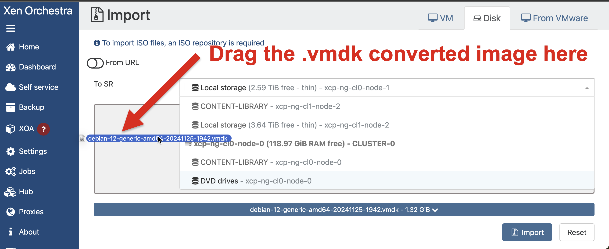
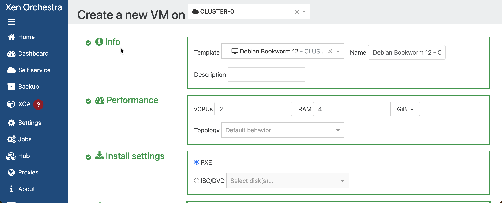
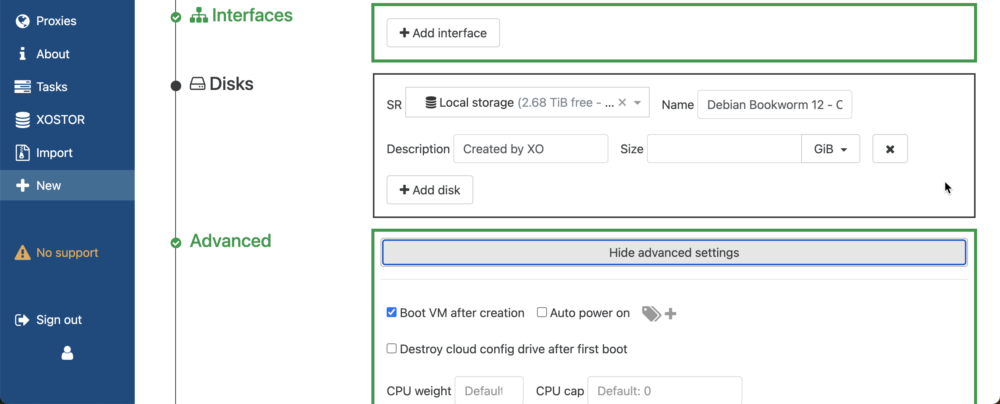
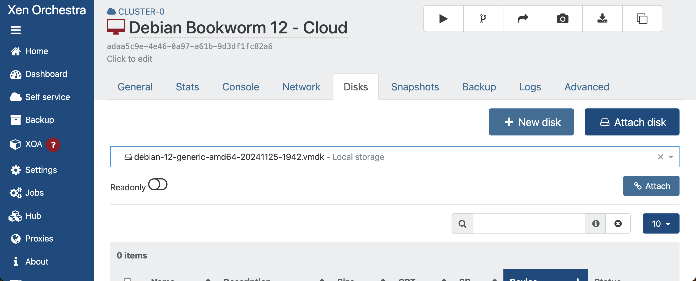

# tofu-xen-k3s
This repository contains Terraform ([OpenTofu](https://opentofu.org/docs/)) to fully automate deploying a [K3S](https://docs.k3s.io/) Kubernetes cluster on Xex ([XCP-NG](https://docs.xcp-ng.org/)), with some additional benefits like [`kube-vip`](https://kube-vip.io/docs/usage/k3s/) for server load-balancing and [`metallb`](https://metallb.io/) for application load balancing.

The Terraform relies heavily on [cloud-init](https://cloudinit.readthedocs.io/en/latest/index.html) which is used to configure the VMs with all this goodness.

## Getting Started
Create a `.env` file with the following variables:

    export TF_VAR_XOA_URL=wss://<your_xoa_hostname_or_ip>
    export TF_VAR_XOA_USER=<your_xoa_username>
    export TF_VAR_XOA_PASSWORD=<your_xoa_password>

Now source the `.env` file: `source .env`

### SSH Key Pair
Create an RSA SSH key pair: `ssh-keygen -t rsa -b 4096 -C "your_email@example.com"` and save it to `.ssh/id_rsa` and `.ssh/id_rsa.pub` at the root of this cloned repository.

Change the permissions of the SSH key pair: `chmod 600 ~/.ssh/id_rsa`

    |-- .ssh
        |-- id_rsa
        |-- id_rsa.pub

### K3S Token
Create an folder called `.k3s` in the root of this cloned repository, then create a file in it called `k3s_token`. Add a your desired secret to this file. This token/secret will be used to join the K3S nodes to the cluster.

    |-- .k3s
        |-- k3s_token

### Cloud Image
For the VMs to be created, you will need a cloud image. The guide started by referring to a blog at [mikansoro.org](https://mikansoro.org/blog/debian-cloud-init-xen-orchestra/), however that guide didn't fully work out. Instead, this guide uses a Debian 12 Bookwork cloud image, and uses Terraform to take care of installing the `xe-guest-utilities`.

Therefore, you will need to download the Debian 12 Bookwork cloud image from the [Debian website](https://cdimage.debian.org/images/cloud/bookworm/) and create a Xen Orchestra Template from it (no need to create a new VM from the image, boot it, install guest-utilities, and then create a template from it. Instead, convert to .vmdk, then just create a template from the image with a name of `Debian Bookworm 12 - Cloud`).

 1. Example: `qemu-img convert -f qcow2 -O vmdk debian-12-generic-amd64-20241125-1942.qcow2 debian-12-generic-amd64-20241125-1942.vmdk`
 2. Import the template into Xen Orchestra

 3. Create a new VM the template `Debian Bookworm 12`
 4. Name the VM `Debian Bookworm 12 - Cloud`
 5. Select Install Settings > PXE boot
 6. Remove any interfaces from the VM
 7. Remove any disks from the VM
 7. Uncheck Advanced > Boot VM after creation

 8. Click Create

 9. From the new VM, click Disks > Attach disk, and attach the `.vmdk` file you created in step 1.

 10. From Advanced, change to boot order to Hard-Drive, click Save
 11. Click Convert to Template

### Terraform
Install Tofu:

    brew update
    brew install opentofu

Initialize the Terraform configuration: `tofu init`

Execute the Terraform plan: `tofu plan`.  This will output a list of resources that will be created.

## Deploying the K3S Cluster
This repository contains a Terraform configuration that will deploy a K3S cluster onto `XCP-NG` using `tofu`.

### Planning the Deployment
First, you should `tofu plan` your deployment and review the generated output to ensure that the deployment will meet your requirements.

The Terraform has variables that enable you to customize the deployment, for example:

    tofu plan -var="server_vm_count=2" -var="agent_vm_count=3"

This will show the plan for creating 3 server nodes for high availability and 3 agent nodes for your applications.

When the initial server is created, it will be configured with a static IP address, which can be defined during execution.

    tofu plan -var="server_vm_count=2" -var="agent_vm_count=3" -var="cluster_start_ip=192.168.1.10"

Each additional server node will be configured with a static IP address, which will be incremented by 1 for each additional server node.

_NOTE Agent nodes are configured with DHCP._

The automation installs `kube-vip` so that the cluster can be load balanced through a load balancer IP address, which can also be defined during execution.

    tofu plan -var="server_vm_count=2" -var="agent_vm_count=3" -var="cluster_alb_ip=192.168.1.10"

The automation also installs `metallb` so that your applications can be load balanced through a load balancer IP address range, which can also be defined during execution.

    tofu plan -var="server_vm_count=2" -var="agent_vm_count=3" -var="load_balancer_ip=192.168.1.10" -var="metallb_ip_range=192.168.1.30-192.168.1.40"

### Executing the Deployment
If the plan looks good, you can execute it with `tofu apply`. Here is an example of executing the deployment with the variables defined above:

    tofu apply -var="server_vm_count=2" -var="agent_vm_count=3" -var="cluster_start_ip=192.168.1.10" -var="load_balancer_ip=192.168.1.10" -var="metallb_ip_range=192.168.1.30-192.168.1.40"

Unless you have provided your own names, you should expect the following resources to be created in XOA:

**K3S Cluster**
 - TOFU-SRVR-0
 - TOFU_SRVR-1
 - TOFU_SRVR-2

**K3S Agent Nodes**
 - TOFU_AGNT-0
 - TOFU_AGNT-1
 - TOFU_AGNT-2

During provisioning, the first VM `TOFU-SRVR-0` will be configured with a static IP address, and when the IP is assigned, the automation will then begin to check for the readiness of the k3s cluster, for which it will then download the `kube-config` file locally for you to later execute `kubectl` commands.

Also, after the k3s cluster is ready, the automation will then install `kube-vip` and `metallb` onto the cluster, and then configure the load balancer IP address and load balancer IP range.

Finally, the automation will create the additional server nodes and agent nodes, and then join them to the k3s cluster.

## Inspirations
This Terraform configuration was inspired by the following sources:

 - https://mikansoro.org/blog/debian-cloud-init-xen-orchestra/
 - https://technotim.live/posts/k3s-etcd-ansible/