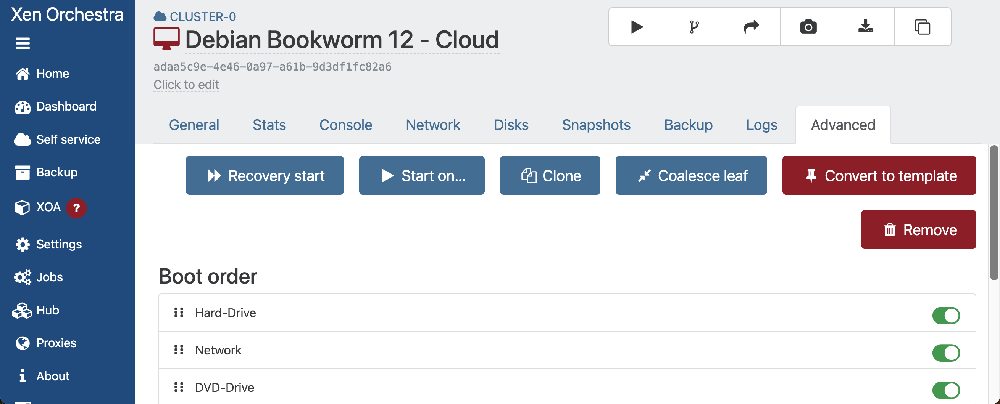

# tofu-xen-k3s
This repository contains Terraform ([OpenTofu](https://opentofu.org/docs/)) to fully automate deploying a [K3S](https://docs.k3s.io/) Kubernetes cluster on a Xen cluster ([XCP-NG](https://docs.xcp-ng.org/)), with some additional benefits like:

 - [`kube-vip`](https://kube-vip.io/docs/usage/k3s/) for server load-balancing
 - [`metallb`](https://metallb.io/) for application load balancing
 - [`cert-manager`](https://cert-manager.io/docs/) for SSL/TLS certificates
 - [`traefik`](https://doc.traefik.io/traefik/) for ingress routing

The Terraform relies heavily on [cloud-init](https://cloudinit.readthedocs.io/en/latest/index.html) which is used to configure the VMs with all this goodness.

## Getting Started
Create a `.env` file with the following variables:

    export TF_VAR_XOA_URL=wss://<your_xoa_hostname_or_ip>
    export TF_VAR_XOA_USER=<your_xoa_username>
    export TF_VAR_XOA_PASSWORD=<your_xoa_password>

Now source the `.env` file: `source .env`

### SSH Key Pair
Create an RSA SSH key pair: `ssh-keygen -t rsa -b 4096 -C "your_email@example.com"` and save it to `.ssh/id_rsa` and `.ssh/id_rsa.pub` at the root of this cloned repository.

Change the permissions of the SSH key pair: `chmod 600 ~/.ssh/id_rsa`

    |-- .ssh
        |-- id_rsa
        |-- id_rsa.pub


### K3S Token
Create a folder called `.k3s` in the root of this cloned repository, then create a file in it called `k3s_token`. Add a your desired secret to this file. This token/secret will be used to join the K3S nodes to the cluster.


    |-- .k3s
        |-- k3s_token

### Cloud Image
For the Xen VMs to be created, you will need a cloud image.

This guide started by referring to a blog at [mikansoro.org](https://mikansoro.org/blog/debian-cloud-init-xen-orchestra/), however that guide didn't fully work out. Instead, this guide uses a Debian 12 Bookwork cloud image, and uses Terraform to take care of installing the `xe-guest-utilities`.

Therefore, you will need to download the Debian 12 Bookwork cloud image from the [Debian website](https://cdimage.debian.org/images/cloud/bookworm/) and create a Xen Orchestra Template from it (no need to create a new VM from the image, boot it, install guest-utilities, and then create a template from it), instead, just convert the `qcow2` image to a `.vmdk` disk, then create a template from the image with a name of `Debian Bookworm 12 - Cloud`.

**Example**:
 1. `qemu-img convert -f qcow2 -O vmdk debian-12-generic-amd64-20241125-1942.qcow2 debian-12-generic-amd64-20241125-1942.vmdk`
 2. Import the template into Xen Orchestra


 3. Create a new VM based on an existing template `Debian Bookworm 12`
 4. Name the VM `Debian Bookworm 12 - Cloud`
 5. Select Install Settings > PXE boot
 6. Remove any interfaces from the VM
 7. Remove any disks from the VM
 7. Uncheck Advanced > Boot VM after creation


 8. Click Create

 9. From the new VM, click Disks > Attach disk, and attach the `.vmdk` file you created in step 1.


 10. From Advanced, change to boot order to Hard-Drive, click Save
 11. Click Convert to Template



### Terraform
Install [OpenTofu](https://opentofu.org/docs/):

    brew update
    brew install opentofu

After cloning this repository and at the root of the project, initialize the Terraform configuration: `tofu init`.

Execute the Terraform plan: `tofu plan`.

This will output a list of resources for your review prior to committing to creating any resources.

## Deploying the K3S Cluster
This repository contains a Terraform configuration that will deploy a K3S cluster onto `XCP-NG` using `tofu`.

### Planning the Deployment
First, you should `tofu plan` your deployment and review the generated output to ensure that the deployment will meet your requirements.

The Terraform has variables that enable you to customize the deployment, for example:

```
tofu plan -var="agent_node_count=3"
```

The output will show the plan for creating server nodes (based on your XCP-NC pool host count, for high availability) and 3 agent nodes for your applications.

When you are ready, execute `tofu apply -var="agent_node_count=3"`. When the first server node is actually created, it will be configured with a static IP address (also configurable as a variable).

```
tofu apply -var="agent_node_count=3" -var="cluster_start_ip=192.168.1.10"
```

Using affinity, a server node will get created for each host within the XCP-NG XOA pool.

Each additional server node will be configured with a static IP address, which will be incremented by 1 for each additional server node. Example, if the first server node is configured with a static IP address of `192.168.1.10`, the second server node will be configured with a static IP address of `192.168.1.11`, etc.

_NOTE Agent nodes are configured with DHCP, and they are also dispersed through affinity_

### Kube-VIP
So that the cluster can be managed through a single load balancer IP address, the automation installs `kube-vip`. Be sure to also specify the IP address of the load balancer which will be used for the `kube-vip` VIP.

```
tofu plan -var="agent_node_count=3" -var="server_alb_ip=192.168.1.10"
```

### Metallb
The automation also installs [`metallb`](https://metallb.io/) so that your applications can be load balanced through a load balancer IP address range, which can also be defined during execution.

```
tofu plan -var="agent_node_count=3" -var="server_alb_ip=192.168.1.10" -var="agent_alb_ip_range=192.168.1.30-192.168.1.40"
```

### Executing the Deployment
If the `tofu plan` looks good, you can execute it with `tofu apply`. Here is an example of executing the deployment with the variables defined above:

```
tofu apply -var="agent_node_count=3" -var="load_balancer_ip=192.168.1.10" -var="cluster_start_ip=192.168.1.11" -var="agent_alb_ip_range=192.168.1.30-192.168.1.40"
```

Unless you have provided your own names, you should expect the following resources to be created in XOA:

**K3S Cluster**
 - TOFU-SRVR-0
 - TOFU_SRVR-1
 - TOFU_SRVR-2

**K3S Agent Nodes**
 - TOFU_AGNT-0
 - TOFU_AGNT-1
 - TOFU_AGNT-2

During provisioning, the first VM `TOFU-SRVR-0` will be configured with a static IP address, and when the IP is assigned, the automation will then begin to check for the readiness of the k3s cluster.

When the cluster is ready, the automation will download the `kube-config` file locally for you. This makes it convenient for you to execute `kubectl` commands from your local machine against the cluster.

Also, after the k3s cluster is ready, the automation will then install `kube-vip` and `metallb` on the cluster, and then configure the load balancer IP address and load balancer IP range.

Finally, the automation will create the additional server nodes and agent nodes, and then join them to the k3s cluster.

## With Cert-Manager
You have an additional option to install [`cert-manager`](https://cert-manager.io/docs/) on the cluster.

**IMPORTANT**: _This option should not be used unless you have first manually configured `cert-manager` in your cluster using the `staging` issuer and you have thoroughly tested certificate issuance. Once tested & validated, the cluster can be destroyed and recreated with cert-manager` through the provided automation._

Before proceeding, you will need to update and source your `.env` file. The following environment variables are required:

 - **CERT_MANAGER_CLOUDFLARE_EMAIL**: `<cloudflare-email>` associated with the Cloudflare account.
 - **CERT_MANAGER_CLOUDFLARE_API_TOKEN**: `<cloudflare-api-token>` retrieved from you Cloudflare account.
 - **CERT_MANAGER_CLOUDFLARE_DNS_SECRET_NAME_PREFIX**: `<cloudflare-secret-name-prefix>` to be used for the Cloudflare DNS secret, e.g. A value of `my-domain-com` will result in a K3S secret `my-domain-com-production-tls` for appending to other app installations.
 - **CERT_MANAGER_CLOUDFLARE_DNS_ZONE**: `<cloudflare-dns-zone>` e.g. `my-domain.com`
 - **CERT_MANAGER_LETSENCRYPT_EMAIL**: `<your-email-address>` to be used for the Let's Encrypt email address.

When you execute the Terraform `apply`, you can define the `with_cert_manager` variable to `true` to automatically install `cert-manager` onto the cluster.

```
tofu plan -var="with_cert_manager=true"
```

Or:

```
tofu apply -auto-approve -var="with_cert_manager=true"
```

**IMPORTANT**: _This option will install the `staging` issuer by default, allowing you to verify and ensure Let's Encrypt returns a valid staging certificate.  If using a misconfigured `production` certificate, Let's Encrypt can block DNS challenges preventing SSL/TLS renewal for up to 7 days._

If you are ready to install the K3S cluster using a `production` certificate, you can define the `with_cert_manager` variable to `true` and define the `use_production_issuer` variable to `true`.

**Example**:

```
tofu apply -var="with_cert_manager=true" -var="use_production_issuer=true"
```

## With Traefik
You have an additional option to install [`Traefik`](https://doc.traefik.io/traefik//) on the cluster.

This capability enables you to expose your K3S apps to your external network's subnet.

Additionally, when paired with [cert-manager](https://cert-manager.io/docs/), you can configure `IngressRoute`s with Traefik to expose trusted certificate issued by Let's Encrypt.

**NOTE**: _The Traefik configuration files provided assume [cert-manager](https://cert-manager.io/docs/) is installed. You must define the `with_traefik` variable to `true` to install Traefik onto the cluster._

**NOTE**: _The Traefik configuration requires at least 1 agent node._

### Automatically Configure Traefik
Before proceeding, you will need to update and source your `.env` file. The following environment variables are required:

 - **TF_VAR_TRAEFIK_DASHBOARD_AUTH**: `<traefik_dashboard_auth>` a base64 encoded username & password to enable the Traefik dashboard to accept basic authentication.
 - **TF_VAR_TRAEFIK_DASHBOARD_HOST**: `<traefik_dashboard_host>` the hostname to expose the Traefik dashboard.
 - **TF_VAR_CERT_MANAGER_CLOUDFLARE_DNS_SECRET_NAME_PREFIX**: `<cloudflare-secret-name-prefix>` to be used for the Cloudflare DNS secret, e.g. A value of `my-domain-com` will result in a K3S secret `my-domain-com-production-tls` for appending to other app installations.

When you execute the Terraform `apply`, you can define the `with_traefik` variable to `true` to automatically install `Traefik` onto the cluster.

```
tofu plan -var="with_cert_manager=true" -var="with_traefik=true"
```

Or:

```
tofu apply -auto-approve -var="with_cert_manager=true" -var="with_traefik=true"
```

**NOTE**: _When installing Traefik and Cert-Manager, an additional Cloudflare certificate and secret will be installed in the `traefik` namespace. Once installed you will be able to access the Traefik dashboard at https://traefik.my-domain.com/ using a certificate generated by Let's Encrypt._


## Inspirations
This Terraform configuration was inspired by the following sources:

 - https://mikansoro.org/blog/debian-cloud-init-xen-orchestra/
 - https://technotim.live/posts/k3s-etcd-ansible/